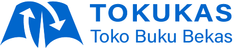

## About **Tokukas**

**Tokukas** is a combination of three words, *"Toko"* (market), *"Buku"* (book), and *"Bekas"* (second-hand). Tokukas is a place to buy and sell second-hand books.

## Detail Project

**Tokukas** website is built using [Laravel](https://laravel.com/docs) and another package such as:

- [Inertia.js](https://inertiajs.com)
- [React](https://reactjs.org)
- [Vite](https://vitejs.dev)
- [Material UI](https://mui.com/material-ui/getting-started/overview)
- [Tailwind CSS](https://tailwindcss.com)

## Contributing

Thank you for considering contributing to Tokukas website! The contribution guide can be found in the [Contributing file](CONTRIBUTING.md). Please read it carefully before making a pull request.

## Code of Conduct

In order to ensure that the Laravel community is welcoming to all, please review and abide by the [Code of Conduct](CODE_OF_CONDUCT.md).

## Security Vulnerabilities

If you discover a security vulnerability within Tokukas Website, please send an e-mail to Admin via [admin@tokukas.site](mailto:admin@tokukas.site). All security vulnerabilities will be promptly addressed. Please do not disclose security-related issues publicly until they have been resolved.

## License

The Laravel framework is open-sourced software licensed under the [MIT license](https://opensource.org/licenses/MIT).
